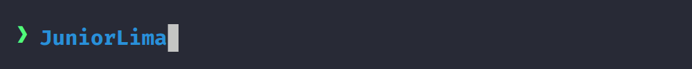

 
 
 

---

### 👾 Sobre mim:

- 🖥️  Desenvolvedor Full-Stack 
- 🎮  Entusiasta de Game Developer [LD48](https://ldjam.com/events/ludum-dare/48/britaminer)
- ⭐  Amo aprender coisas novas no meu tempo livre

---

### :hammer_and_wrench: Linguagens e Ferramentas :

 &nbsp;
 &nbsp;
 &nbsp;
 &nbsp; 
 &nbsp;
 &nbsp;
 &nbsp;
 &nbsp;
 &nbsp;
 &nbsp;
 &nbsp;

---

 

 
